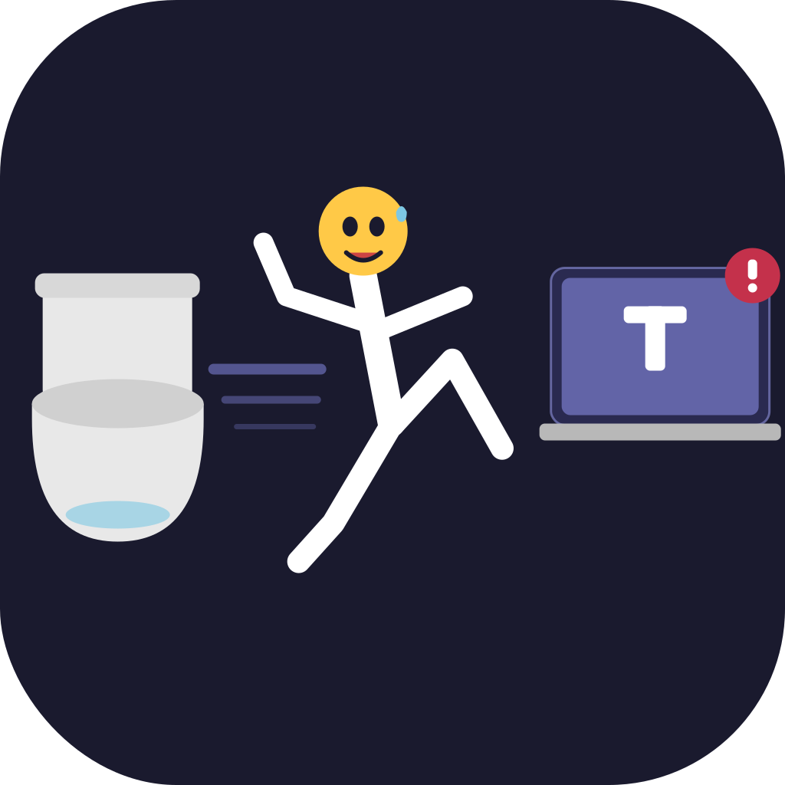

<div align="center">
  
  <h1>Mention Monitor</h1>
  <p><strong>Never miss your name in a Microsoft Teams meeting.</strong></p>
  <p>
    
    
    
  </p>
  <p>A 108 KB native macOS menu bar app that monitors Microsoft Teams live captions in real-time and sends a desktop notification the moment someone mentions you.</p>
  <p><em>No cloud. No bots. No subscriptions. Nothing leaves your machine.</em></p>
</div>

---

## How it works

Teams exposes live captions through the macOS Accessibility API. The app polls the caption tree every 400ms, detects finalized entries, and checks them against your configured name variants.

## Requirements

- macOS 13+
- Microsoft Teams (new Teams, `com.microsoft.teams2`)
- Live captions enabled in your meeting (⇧⌘A)
- Accessibility permission granted to the app

## Install

Download the latest release or build from source.

### Build from source

Requires Xcode Command Line Tools.

```bash
git clone https://github.com/per6x/YouGotMentioned
cd YouGotMentioned
bash build.sh
# drag MentionMonitor.app to /Applications
```

Grant Accessibility access after first launch:
**System Settings → Privacy & Security → Accessibility → add MentionMonitor**

## Usage

1. Join a Teams meeting and enable live captions (⇧⌘A)
2. Click **🔕** in the menu bar → **Start Monitoring** → icon becomes **🔔**
3. Get a desktop notification when your name appears in captions

Click **Edit name variants…** to configure which names to watch for (comma-separated, supports any script - Latin, Cyrillic, etc.).

## Project structure

```
Sources/MentionMonitor/main.swift   # entire app (~180 lines)
Info.plist                          # app bundle metadata
build.sh                            # builds .app bundle
icon.svg                            # source icon
landing/                            # landing page (GitHub Pages)
```

## License

MIT
